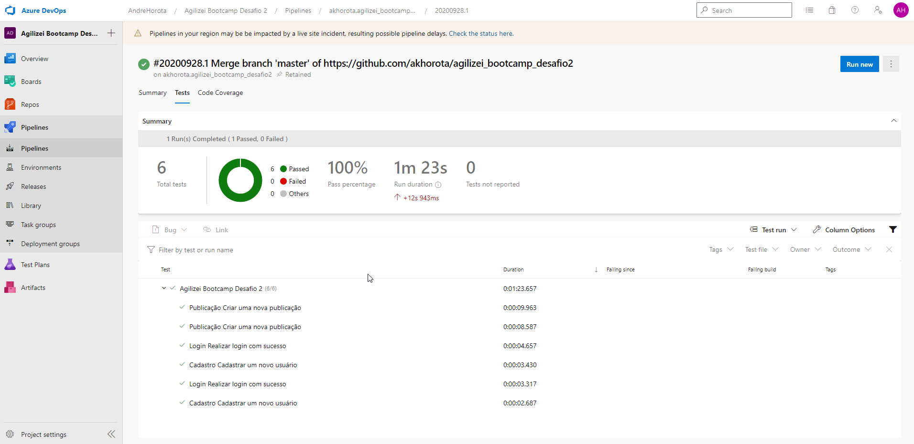
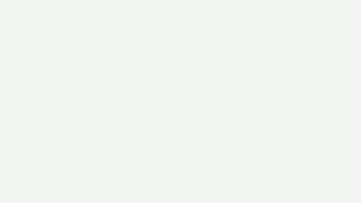

# agilizei_bootcamp_desafio2

Seja bem vindo ao repositório proveniente do Desafio 2 do Agilizei Bootcamp. Neste segundo desafio o objetivo foi adicionar mais asserções nas specs de cadastro, login e articles utilizando rotas e validações em tela. Além disso, colocamos em prática também a execução em múltiplos browsers e CI utilizando o Azure DevOps.

  - Pipeline do projeto no Azure DevOps: https://dev.azure.com/AndreHorota/Agilizei%20Bootcamp%20Desafio%202/_build

  - Execução dos testes na Pipeline do Azure DevOps:

    

  - Execução dos testes utilizando o Electron:

    - Login:
    
    

    - Cadastro:
    
    

    - Articles:
    
    
    
